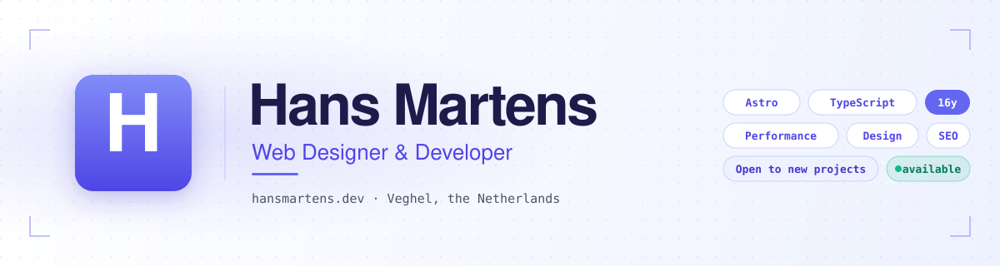
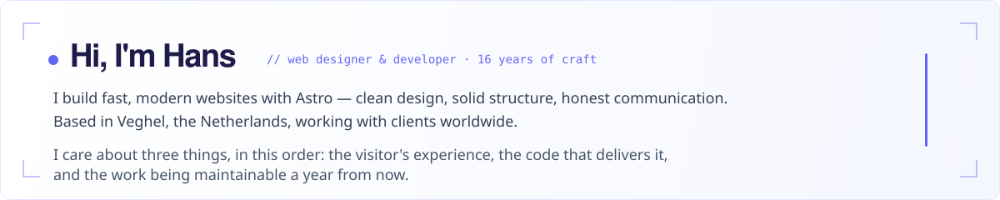
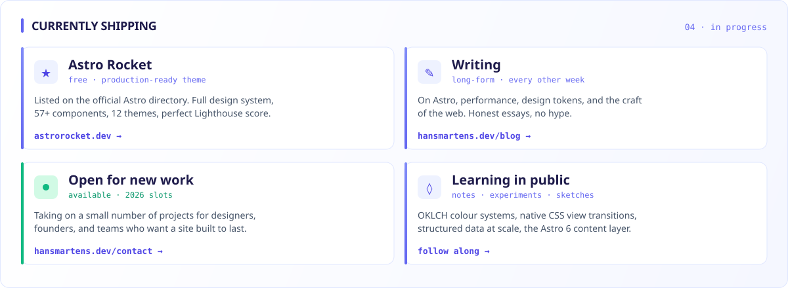
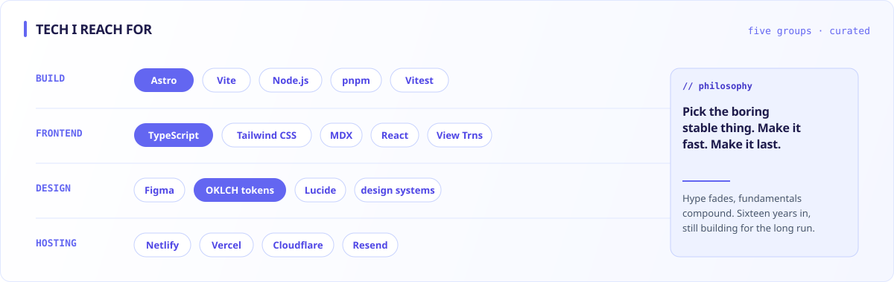
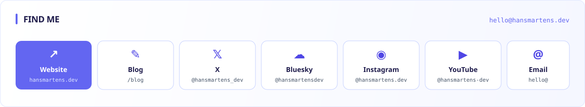

<!-- ============================================================
     Hans Martens — GitHub profile README
     Every section is a paired light/dark SVG, swapped automatically
     via <picture> + prefers-color-scheme. No CSS, no JS — just images.
     Brand: indigo (hue 264°) · #6366f1
     ============================================================ -->

<a href="https://hansmartens.dev">
  <picture>
    <source media="(prefers-color-scheme: dark)" srcset="./banner-dark.svg">
    <source media="(prefers-color-scheme: light)" srcset="./banner-light.svg">
    
  </picture>
</a>

&nbsp;

<picture>
  <source media="(prefers-color-scheme: dark)" srcset="./intro-dark.svg">
  <source media="(prefers-color-scheme: light)" srcset="./intro-light.svg">
  
</picture>

&nbsp;

<picture>
  <source media="(prefers-color-scheme: dark)" srcset="./currently-dark.svg">
  <source media="(prefers-color-scheme: light)" srcset="./currently-light.svg">
  
</picture>

&nbsp;

<picture>
  <source media="(prefers-color-scheme: dark)" srcset="./projects-dark.svg">
  <source media="(prefers-color-scheme: light)" srcset="./projects-light.svg">
  
</picture>

  <a href="https://astrorocket.dev">↗ astrorocket.dev</a> &nbsp;·&nbsp;
  <a href="https://github.com/hansmartensdev/Astro-Rocket">↗ Astro Rocket repo</a> &nbsp;·&nbsp;
  <a href="https://hansmartens.dev">↗ hansmartens.dev</a> &nbsp;·&nbsp;
  <a href="https://hansmartens.dev/blog">↗ blog</a>

&nbsp;

<picture>
  <source media="(prefers-color-scheme: dark)" srcset="./stack-dark.svg">
  <source media="(prefers-color-scheme: light)" srcset="./stack-light.svg">
  
</picture>

&nbsp;

<picture>
  <source media="(prefers-color-scheme: dark)" srcset="https://github-readme-stats.vercel.app/api?username=hansmartensdev&show_icons=true&hide_border=true&bg_color=00000000&title_color=a5b4fc&icon_color=818cf8&text_color=cbd5e1&hide=contribs&include_all_commits=true">
  
</picture>

<picture>
  <source media="(prefers-color-scheme: dark)" srcset="https://github-readme-stats.vercel.app/api/top-langs/?username=hansmartensdev&layout=compact&hide_border=true&bg_color=00000000&title_color=a5b4fc&text_color=cbd5e1&langs_count=8">
  
</picture>

&nbsp;

<a href="https://hansmartens.dev">
  <picture>
    <source media="(prefers-color-scheme: dark)" srcset="./connect-dark.svg">
    <source media="(prefers-color-scheme: light)" srcset="./connect-light.svg">
    
  </picture>
</a>

  
    Banner, cards, and site share the same OKLCH brand tokens — one design system, everywhere. &nbsp;·&nbsp;
    <code>indigo · hue 264°</code> &nbsp;·&nbsp;
    Built with <a href="https://astro.build">Astro</a> on <a href="https://astrorocket.dev">Astro Rocket</a>.
  

